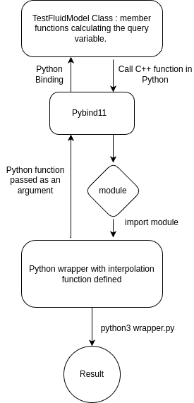



- ## Student: Vaishnavi Gupta
- ## Github: [VAISHNAVI04GUPTA](https://github.com/VAISHNAVI04GUPTA)
- ## Organization: [SU2 Foundation](https://su2code.github.io/)
- ## Mentors: Evert Bunschoten, Nijso Beishuizen

-----

# **CONTENTS**

- [**Overview**](#_l514hjebouue)
- [**Functionality**](#_wmydfbdy5110)
- [**Issues Faced**](#_cskkggnz45tv)
- [**What’s left**](#_uclww4nm4ub6)
- [**Post GSoC**](#_2x4i0gykvxpx)
- [**Closing Remarks**](#_ny239r5uxmqn)

**Overview**

The primary goal of this project is to enable the **use of generic Python functions within SU2** for data-driven fluid modeling applications. By linking Python functions through the SU2 Python wrapper, we aim to enhance the robustness of thermochemical look-up operations. The [Pybind11 library](https://github.com/pybind/pybind11) facilitates this integration of Python functions into SU2.

This integration enables the **Pybind11 library** to communicate with the **SU2 driver**, enabling the invocation of interpolation functions on reference data to predict the thermodynamic state of fluids. In this setup, Pybind11 serves as a crucial link, facilitating the incorporation of more accurate interpolation techniques into SU2, thus enhancing user flexibility, robustness and memory efficiency.

Pybind11 is a lightweight header-only library that enables seamless interoperability between C++ and Python. Here, it allows us to implement performance-critical components in C++ while leveraging Python's ease of use for higher-level scripting.

**Functionality**

Currently, SU2 exploits the capabilities of the **Python wrapper** to couple the C++ codebase with an external structural solver. To extend this functionality into Look-up table interpolation of thermodynamic data, I have worked majorly on the following subpoints:

- Set up interpolation methods in Python using the **Scipy** library and added them to SU2 using wrapper classes.
- Added Pybind11 library as a **submodule** into SU2
- Created a linkage of passing Python functions in the wrapper to be passed as arguments in C++ functions using Pybind11.
- A **Unit test case** showcasing the successful integration of Pybind11 to SU2 has also been added for new users.

The Pybind11 functionality can now be enabled in SU2 by giving the meson command -Denable-Pybind11=true while building SU2.

The **TestFluidModel** class is used to compute the thermo-chemical state for combustion simulation. This class determines the thermo-chemical state based on a set of transported scalars. For the current application, the fuel considered was methane.

The integration of the Python interpolation function has been made possible by using the **PYBIND\_MODULE** method of the Pybind library. The module wraps C++ functions into a module that can thus be imported into Python and used to pass the query variables. Secondly, the Python interpolation function is passed as an argument to the prediction function defined in SU2, which can be accessed from the wrapper and produce desirable results of Equation of State or other state-defining variables.

The above functionality can be understood as : 

**Issues Faced**

It was probably debugging, wherein I spent most of my time compared to actually coding it!

I faced quite a few blockers at a later stage of the project. This was probably because I started working in depth with Pybind11 and integrating it into a large codebase for the first time.

The major issue in developing the functionality is linking the SU2 **Driver Classes** with the Python wrapper through **pysu2**, which is based on **SWIG** and uses the **mpi4py** library to run the simulations. The SU2 Driver class initializer constructor takes the **SU2\_Comm** type of arguments, a datatype defined in the mpi4py library. So, to compile the member functions of the driver class into a module, integration of the Mpi4py object into the Pybind11 library is required.

The main roadblock is linking the two Python libraries (Pybind11 and Mpi4py) and using them simultaneously in SU2. 

**What’s Left**

The next steps in this project would include working with **mpi4py object creation** or defining a custom datatype in Pybind to link the two libraries and create a module for CDriver Classes. **There might be a possibility of writing a SWIG interface file for Pybind11 to integrate the library into pysu2 easily!**

These modules can then easily be imported into wrapper files, and the member functions can be used. Inside the Driver class, the Python function argument passed into C++ can be made into a **CConfig class** object and then be universally used in the **CFluidModel classes**.

Also, a complete and well-documented tutorial and demonstration must be set up to help new and experienced users fully utilize the service this project will cater to.

**After GSoC**

After an incredibly rewarding journey with Google Summer of Code (GSoC), I have gained invaluable experience and knowledge that extends far beyond the project itself. Working on this project has not only deepened my technical skills in C++, Python, and Pybind11 but also enriched my understanding of open-source collaboration, version control, and efficient coding practices. The challenges I faced pushed me to think critically and problem-solve effectively, fostering both professional growth and personal development. 

Though the GSoC "coding phase" has ended, I will still be *unofficially* working closely with the SU2 team to complete the last part of my proposed plan, i.e, to link the Pybind11 library with pysu2 and, through the CConfig class, make the python functions readily available in any FluidModel class. Apart from this, I look forward to reviewing the code and providing well-summarized documentation as well :)

**Closing Remarks**

Throughout this program, the support from my mentors and the open-source community has been phenomenal. Their guidance helped me navigate complex problems and refine my approach to software development. As I close this chapter, I carry forward the lessons learned and the connections made with a renewed commitment to contributing to open-source projects in the future.

Thank you to everyone who made this journey possible. I look forward to continuing my involvement in the open-source community and applying the skills and knowledge gained from this GSoC experience to future endeavors.

